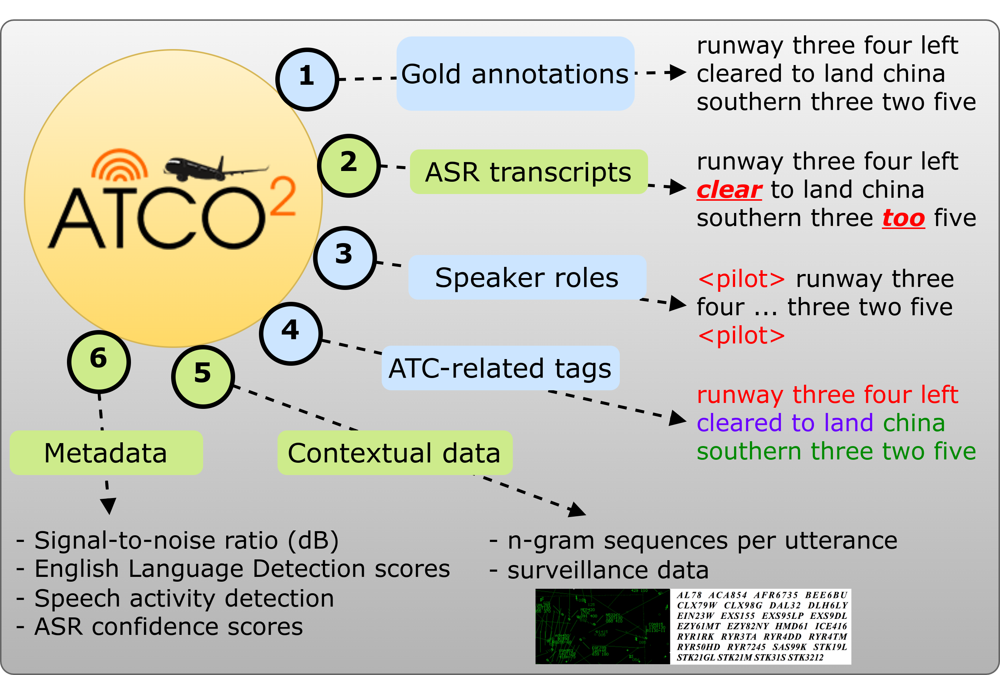

# ATCO2 corpus: A Large-Scale Dataset for Research on Automatic Speech Recognition and Natural Language Understanding of Air Traffic Control Communications 


<p align="center">
    <a href="https://github.com/idiap/atco2-corpus/blob/master/LICENSE">
        
    </a>
    <a href="https://github.com/idiap/atco2-corpus">
        
    </a>
    <a href="https://github.com/psf/black">
        
    </a>
</p>

<p align="center">
    <a href="https://huggingface.co/Jzuluaga/wav2vec2-large-960h-lv60-self-en-atc-uwb-atcc-and-atcosim">
        
    </a>
    <a href="https://huggingface.co/Jzuluaga/bert-base-ner-atc-en-atco2-1h">
        
    </a>
    <a href="https://huggingface.co/Jzuluaga/bert-base-token-classification-for-atc-en-uwb-atcc">
        
    </a>
</p>

Code for the paper [ATCO2 corpus: A Large-Scale Dataset for Research on Automatic Speech Recognition and Natural Language Understanding of Air Traffic Control Communications](https://arxiv.org/abs/2211.04054).

<details>
  <summary markdown="span"><b>Personal assistants, automatic speech recognizers and dialogue understanding systems are becoming more critical in our interconnected digital world</b>. A clear example is air traffic control (ATC) communications....</summary>  
  
    ATC aims at guiding aircraft and controlling the 
    airspace in a safe and optimal manner. These voice-based dialogues 
    are carried between an air traffic controller (ATCO) and pilots via 
    very-high frequency radio channels. In order to incorporate these 
    novel technologies into ATC (low-resource domain), large-scale 
    annotated datasets are required to develop the data-driven AI 
    systems. Two examples are automatic speech recognition (ASR) and 
    natural language understanding (NLU). In this paper, we introduce the 
    ATCO2 corpus, a dataset that aims at fostering research on the 
    challenging ATC field, which has lagged behind due to lack of 
    annotated data. The ATCO2 corpus covers 1) data collection and pre-
    processing, 2) pseudo-annotations of speech data, and 3) extraction 
    of ATC-related named entities. The ATCO2 corpus is split into three 
    subsets. 1) ATCO2-test-set corpus contains 4 hours of ATC speech with 
    manual transcripts and a subset with gold annotations for named-
    entity recognition (callsign, command, value). 2) The ATCO2-PL-set 
    corpus consists of 5281 hours of unlabeled ATC data enriched with 
    automatic transcripts from an in-domain speech recognizer, contextual 
    information, speaker turn information, signal-to-noise ratio estimate 
    and English language detection score per sample. Both available for 
    purchase through ELDA at this http URL. 3) The ATCO2-test-set-1h 
    corpus is a one-hour subset from the original test set corpus, that 
    we are offering for free at this https URL. We expect the ATCO2 
    corpus will foster research on robust ASR and NLU not only in the 
    field of ATC communications but also in the general research 
    community.
</details>

<p align="center">
 <figure>
  
  <figcaption> ATCO2 corpus ecosystem. Blue circles denote annotations only available for ATCO2 test set corpus. Green circles denote annotations and metadata available for both ATCO2 test set and ATCO2 pseudo-labeled corpus sets. </figcaption>
</figure> 
</p>


**Repository written by**: [Juan Pablo Zuluaga](https://juanpzuluaga.github.io/).

---
## Table of Contents
- [Preparing Environment](#preparing-environment)
- [Usage](#usage)
    - [Download the Data](#download-the-data)
    - [Training one model](#training-one-model)
    - [Train baselines](#train-baselines)
    - [Train your LM with KenLM (optional)](#train-your-lm-with-kenlm-optional)
    - [Evaluate models (optional)](#evaluate-models-optional)
- [Related work](#related-work)
- [Cite us](#how-to-cite-us)

# Preparing Environment

The first step is to create your environment with the required packages for data preparation, formatting, and to carry out the experiments. You can run the following commands to create the conda environment (assuming CUDA - 11.7):

- Step 1: Using `python 3.10`: install python and the requirements

```bash
git clone https://github.com/idiap/w2v2-air-traffic
conda create -n atco2_corpus python==3.10
conda activate atco2_corpus
python -m pip install -r requirements.txt
```

Before running any script, make sure you have `en_US` locale set and `PYTHONPATH` in repository root folder.

```bash
export LANG=en_US.UTF-8 LC_ALL=en_US.UTF-8
export PYTHONPATH=$PYTHONPATH:$(pwd) #assuming you are in root repository folder
```

# Usage

There are several steps to replicate/use our proposed models:

## Out-of-the box model on HuggingFace


# What can you do with ATCO2 corpus? 

### Automatic Speech Recognition

- This system allows to optain the text level information of what was said in the ATC communication. It is normally used later in the next systems below 


### Speaker Role Identification


- With this module, you can detect who is talking in the given communication
### Named-Entity Recognition

- Here, you aim at understanding what was said in the communicaiton. With ATCO2 corpus you can train a system that can detect callsigns, commands and values in the communication.


# Related work

Here is a list of papers that are somehow related to AI/ML targeted to Air traffic control communications:

- Fine-tuning a pretrained BERT model on the named entity recognition task to perform text-based diarization for ATC communications: 
    - paper: [BERTraffic: BERT-based Joint Speaker Role and Speaker Change Detection for Air Traffic Control Communications](https://arxiv.org/abs/2110.05781)
    - code: https://github.com/idiap/bert-text-diarization-atc
- Fine-tuning a pretrained [Wav2vec 2.0](https://github.com/facebookresearch/fairseq/tree/main/examples/wav2vec) model for automatic speech recognition: 
    - paper: [How Does Pre-trained Wav2Vec 2.0 Perform on Domain Shifted ASR? An Extensive Benchmark on Air Traffic Control Communications](https://arxiv.org/abs/2203.16822)
    - code: https://github.com/idiap/w2v2-air-traffic

- How to use contextual data (biasing) in ATC automatic speech recognition:
    - Paper: [A two-step approach to leverage contextual data: speech recognition in air-traffic communications](https://arxiv.org/abs/2202.03725)
- Ethics in collection of ATC audio data: [Legal and Ethical Challenges in Recording Air Traffic Control Speech](https://aclanthology.org/2022.legal-1.14/)


Some other papers:

- [Boosting of contextual information in ASR for air-traffic call-sign recognition](http://www.fit.vutbr.cz/research/groups/speech/publi/2021/kocour21_interspeech.pdf)
- [Grammar Based Identification Of Speaker Role For Improving ATCO And Pilot ASR](https://arxiv.org/abs/2108.12175)
- [Contextual Semi-Supervised Learning: An Approach To Leverage Air-Surveillance and Untranscribed ATC Data in ASR Systems](https://arxiv.org/abs/2104.03643)
- [Automatic Processing Pipeline for Collecting and Annotating Air-Traffic Voice Communication Data](https://www.mdpi.com/2673-4591/13/1/8)
- [Automatic Call Sign Detection: Matching Air Surveillance Data with Air Traffic Spoken Communications](https://www.mdpi.com/2504-3900/59/1/14)
- [Improving callsign recognition with air-surveillance data in air-traffic communication](https://arxiv.org/abs/2108.12156)
- [Automatic Speech Recognition Benchmark for Air-Traffic Communications](https://arxiv.org/abs/2006.10304)


---
# How to cite us

If you use this code for your research, please cite our papers with the following bibtex items:

```
# article 1 - MAIN
@article{zuluaga2022atco2,
  title={ATCO2 corpus: A Large-Scale Dataset for Research on Automatic Speech Recognition and Natural Language Understanding of Air Traffic Control Communications},
  author={Zuluaga-Gomez, Juan and Vesel{\'y}, Karel and Sz{\"o}ke, Igor and Motlicek, Petr and others},
  journal={arXiv preprint arXiv:2211.04054},
  year={2022}
}

# article 2 - Mainly on ASR
@inproceedings{zuluaga2023does,
  title={How does pre-trained Wav2Vec 2.0 perform on domain-shifted ASR? An extensive benchmark on air traffic control communications},
  author={Zuluaga-Gomez, Juan and Prasad, Amrutha and Nigmatulina, Iuliia and Sarfjoo, Seyyed Saeed and Motlicek, Petr and Kleinert, Matthias and Helmke, Hartmut and Ohneiser, Oliver and Zhan, Qingran},
  booktitle={2022 IEEE Spoken Language Technology Workshop (SLT)},
  pages={205--212},
  year={2023},
  organization={IEEE}
}

# article 3 - Mainly on sequence classification and BERT  
@inproceedings{zuluaga2023bertraffic,
  title={Bertraffic: Bert-based joint speaker role and speaker change detection for air traffic control communications},
  author={Zuluaga-Gomez, Juan and Sarfjoo, Seyyed Saeed and Prasad, Amrutha and Nigmatulina, Iuliia and Motlicek, Petr and Ondrej, Karel and Ohneiser, Oliver and Helmke, Hartmut},
  booktitle={2022 IEEE Spoken Language Technology Workshop (SLT)},
  pages={633--640},
  year={2023},
  organization={IEEE}
}
```
