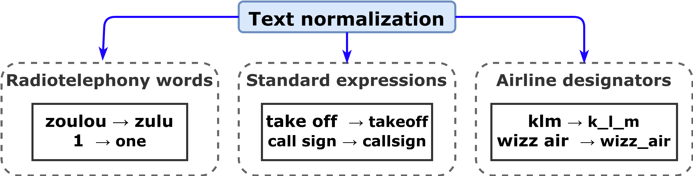

# Data preparation scripts 

<p align="center">
    <a href="https://github.com/idiap/atco2-corpus/blob/master/LICENSE">
        
    </a>
    <a href="https://github.com/idiap/atco2-corpus">
        
    </a>
    <a href="https://huggingface.co/datasets/Jzuluaga/atco2_corpus_1h">
        
    </a>
    <a href="https://huggingface.co/datasets/Jzuluaga/uwb_atcc">
        
    </a>
    <a href="https://github.com/psf/black">
        
    </a>
</p>


## Table of Contents
- [Downloading Data](#downloading-data)
- [Preparing the Data](#preparing-the-data)
- [Cite us](#how-to-cite-us)

---
## Downloading Data

For the experiments carried out in this paper, you need to download the data folder one by one as follows:

### **ATCO2 test set corpus**

- Download (purchase) the full test set (used in the paper): http://catalog.elra.info/en-us/repository/browse/ELRA-S0484/
- **Download a free sample of the test set** (only contains 1 hour of data): https://www.atco2.org/data

**Dataset is in HuggingFace**:https://huggingface.co/datasets/Jzuluaga/atco2 |  <a href="https://huggingface.co/datasets/Jzuluaga/atco2"> </a>

### **UWB-ATCC corpus**

The Air Traffic Control Communication corpus or UWB-ATCC corpus, contains recordings of communication between air traffic controllers and pilots. The speech is manually transcribed and labeled with the information about the speaker (pilot/controller, not the full identity of the person). The audio data format is: 8kHz, 16bit PCM, mono.

**You can download this corpus for free in:** https://lindat.mff.cuni.cz/repository/xmlui/handle/11858/00-097C-0000-0001-CCA1-0

This item is Publicly Available and licensed under: Creative Commons - Attribution-NonCommercial-ShareAlike 4.0 International (CC BY-NC-SA 4.0) 

**Dataset is in HuggingFace:** https://huggingface.co/datasets/Jzuluaga/uwb_atcc | <a href="https://huggingface.co/datasets/Jzuluaga/uwb_atcc"> </a>

### **ATCOSIM corpus**

The ATCOSIM Air Traffic Control Simulation Speech corpus is a speech database of air traffic control (ATC) operator speech, provided by Graz University of Technology (TUG) and Eurocontrol Experimental Centre (EEC). It consists of 10 hrs of speech data, which were recorded during ATC real-time simulations using a close-talk headset microphone. The utterances are in English language and pronounced by ten non-native speakers. 

**You can download this corpus for free in:** https://www.spsc.tugraz.at/databases-and-tools/atcosim-air-traffic-control-simulation-speech-corpus.html

**Dataset is in HuggingFace:** https://huggingface.co/datasets/Jzuluaga/atcosim_corpus | <a href="https://huggingface.co/datasets/Jzuluaga/atcosim_corpus"> </a>


### **LDC-ATCC corpus**

The Air Traffic Control Complete (LDC94S14A) or LDC-ATCC corpus is comprised of recorded speech for use in supporting research and development activities in the area of robust speech recognition in domains similar to air traffic control (several speakers, noisy channels, relatively small vocabulary, constrained languaged, etc.) The audio data is composed of voice communication traffic between various controllers and pilots. The audio files are 8 KHz, 16-bit linear sampled data, representing continuous monitoring, without squelch or silence elimination, of a single FAA frequency for one to two hours.

You can purchase it and download here: https://catalog.ldc.upenn.edu/LDC94S14A


---
## Preparing the Data

The folder containing the preparation scripts to format and prepare each dataset looks like:

```python
data/databases/
├── atco2_pl_set
│   ├── create_subsets.sh   # create the subsets, e.g., 2500 hours train set
│   ├── JOURNAL_PLOTS       # plot the figures in our ATCO2 corpus paper
│   ├── local
│   ├── recording_counts.log
│   └── RUN_IT_ALL.sh       # prepare the data in Kaldi format (5000+ hours)
├── atco2_test_set_1h       # prepare ATCO2-test-set-1h (free!)
│   ├── data_prepare_atco2_corpus_kaldi.sh
│   └── data_prepare_atco2_corpus_other.sh
├── atco2_test_set_4h       # prepare ATCO2-test-set-4h (in ELDA catalogue)
│   ├── data_prepare_atco2_corpus_kaldi.sh
│   └── data_prepare_atco2_corpus_other.sh
├── ldc_atcc                # prepare LDC-ATCC (LDC catalogue)
│   ├── data_prepare_ldc_atcc_corpus_kaldi.sh
│   ├── data_prepare_ldc_atcc_corpus_other.sh
│   ├── link_acronyms.sh
│   └── parse_lisp_array.sh
└── uwb_atcc                # prepare UWB-ATCC (free!)
    ├── data_prepare_uwb_atcc_corpus_kaldi.sh
    ├── data_prepare_uwb_atcc_corpus_other.sh
    └── spk_id_tagger.py
```

You can format only one database and do all the experiments with it! **For instance**, [UWB-ATCC corpus](https://lindat.mff.cuni.cz/repository/xmlui/handle/11858/00-097C-0000-0001-CCA1-0) and [ATCOSIM corpus](https://www.spsc.tugraz.at/databases-and-tools/atcosim-air-traffic-control-simulation-speech-corpus.html) are completly free to download and use! You can start right away with it!

### Prepare only one database: UWB-ATCC use case

For preparing one database, you can simply go to root directory and run:

```bash 
conda activate atco2_corpus
bash data/databases/uwb_atcc/data_prepare_uwb_atcc_corpus_other.sh
```

That will generate the files required for all the experiments in `experiments/data/uwb_atcc`. 

**Or for End-to-end ASR and NLP experiments in** `experiments/data/other/uwb_atcc`. 

Each folder contains a `train` and `test` folder. Each folder contains several files. However, the most important ones are: 


- text: contains the transcripts, format: `utt_id transcript`
- segments: contains the acoutisc segmentation information, format `utt_id recording_id t_begin t_end`
- wav.scp: contains the path to the recordings (wav/sph/etc), format: `recording_id /path/to/wav/`
- ner/utt2text_tags: contains the file in IOB format to fine-tune a pre-trained LM in the token-classification task (NER)
- spk_id/utt2text_tags: contains the file to fine-tune a pretrained LM in the speaker classification task (sequence classification)


# Text normalization

<p align="center">
 <figure>
  
  <figcaption> Overall text normalization steps undertaken to prepare the datasets above mentioned. </figcaption>
</figure> 
</p>


---
# How to cite us

If you use this code for your research, please cite our papers with the following bibtex items:

```
# article 1 - MAIN
@article{zuluaga2022atco2,
  title={ATCO2 corpus: A Large-Scale Dataset for Research on Automatic Speech Recognition and Natural Language Understanding of Air Traffic Control Communications},
  author={Zuluaga-Gomez, Juan and Vesel{\`y}, Karel and Sz{\"o}ke, Igor and Motlicek, Petr and Kocour, Martin and Rigault, Mickael and Choukri, Khalid and Prasad, Amrutha and Sarfjoo, Seyyed Saeed and Nigmatulina, Iuliia and others},
  journal={arXiv preprint arXiv:2211.04054},
  year={2022}
}

# article 2 - Mainly on ASR
@article{zuluaga2022how,
    title={How Does Pre-trained Wav2Vec 2.0 Perform on Domain Shifted ASR? An Extensive Benchmark on Air Traffic Control Communications},
    author={Zuluaga-Gomez, Juan and Prasad, Amrutha and Nigmatulina, Iuliia and Sarfjoo, Saeed and Motlicek, Petr and Kleinert, Matthias and Helmke, Hartmut and Ohneiser, Oliver and Zhan, Qingran},
    journal={IEEE Spoken Language Technology Workshop (SLT), Doha, Qatar},
    year={2022}
  }

# article 3 - Mainly on sequence classification and BERT  
@article{zuluaga2022bertraffic,
  title={BERTraffic: BERT-based Joint Speaker Role and Speaker Change Detection for Air Traffic Control Communications},
  author={Zuluaga-Gomez, Juan and Sarfjoo, Seyyed Saeed and Prasad, Amrutha and others},
  journal={IEEE Spoken Language Technology Workshop (SLT), Doha, Qatar},
  year={2022}
  }  
```

