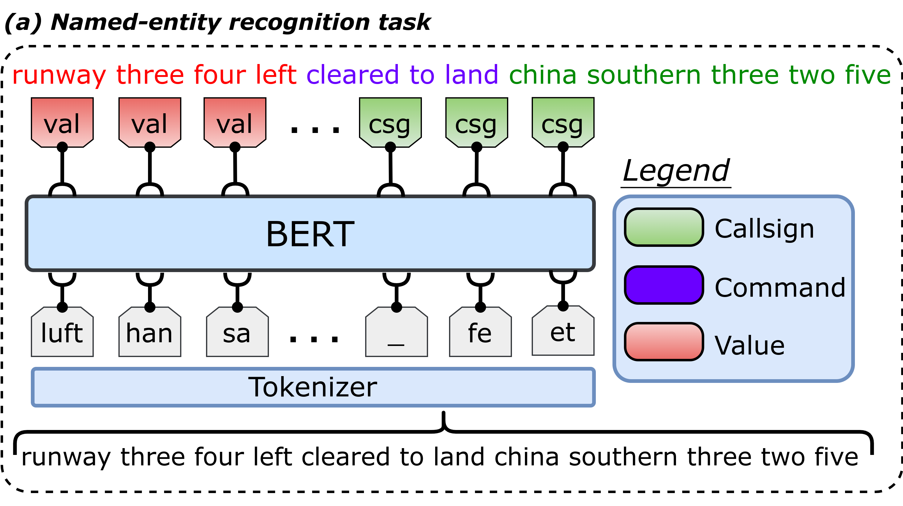

# Named-entity Recognition for ATC Communications

<p align="center">
    <a href="https://github.com/idiap/atco2-corpus/blob/master/LICENSE">
        
    </a>
    <a href="https://github.com/idiap/atco2-corpus">
        
    </a>
    <a href="https://huggingface.co/Jzuluaga/bert-base-ner-atc-en-atco2-1h">
        
    </a>
    <a href="https://huggingface.co/datasets/Jzuluaga/atco2_corpus_1h">
        
    </a>
    <a href="https://github.com/psf/black">
        
    </a>
</p>


This folder contains the main files to train a NER model using the ATCO2 corpus.

<p align="center">
 <figure>
  
  <figcaption> Overall pipeline for performing named-entity recognition on Air traffic control communications. </figcaption>
</figure> 
</p>


For instance, if you have the following transcripts/gold annotations:

- *Utterance*: **lufthansa three two five cleared to land runway three four left**

Could you tell what are the main entities in the communication? The desired output is shown below:

- *Named-entity module output*: [call] lufthansa three two five [/call] [cmd] cleared to land [/cmd] [val] runway three four left [/val]

We tackle this issue by fine-tuning a BERT module on the named-entity recognition task. Continue below if you are interested in how to do this...

# Datasets 

First, we need to donwload and prepare some databases. There are some public databases that are available for free, and some others that are not. We will only focus on the ones that are free! That way you can train/test a baseline model on your ATC data :)

We have already covered the data preparation in the data folder. Check the [README.md](../data/README.md) file in this folder for more information on each database. 


## **ATCO2 test set corpus**

to author's knowldege, ATCO2 corpus is the solely corpus that is both, targeted to named-entity recognition and that is public. There are two main corpus:

**ATCO2-test-set-1h corpus (for free):**

- **Download a free sample of the ATCO2-test-set-1h** (only contains 1 hour of data): https://www.atco2.org/data
- **Corpus in HuggingFace format**: https://huggingface.co/datasets/Jzuluaga/atco2_corpus_1h | <a href="https://huggingface.co/datasets/Jzuluaga/atco2_corpus_1h"> </a>

and,

- **ATCO2-test-set-4h**: Download (purchase) the full test set (contains 4 hour of data, ~3121 samples): http://catalog.elra.info/en-us/repository/browse/ELRA-S0484/


# Structure of the folder

The `ner` folder contains the following files:


```python
ner/
├── train_ner.py            # main python script to train a NER model
├── train_one_model.sh      # bash script that calls the python script to train a NER model
├── run_eval.sh             # bash script to run the evaluation of a NER model
├── eval_ner.py             # python script that loads a NER modul and evaluate it on a test set
├── run_inference.sh        # bash script to run the inference of NER
├── inference_ner.py        # python script that loads a NER model and perform inference
├── __init__.py
├── ner_utils.py            # some utilities used on the scripts
├── fix_ner_tags_file.py    # script to fix tagging issues encountered on ATCO2 corpus
├── gen_kfolds.py           # script to generate the N folds to perform K-fold cross-validation on ATCO2 data
└── README.md
```

# Usage

There are several steps to replicate/use our proposed models:

## Fine-tune a model from scratch

Here, we describe how to train one model with the **atco2-test-set-1h**, which is **free!!!**

You can train a baseline model with **atco2-test-set-1h** by calling the high-level script:

```bash
bash ner/train_one_model.sh
```

That will fine-tune BERT-base [BERT-base-uncased model](https://huggingface.co/bert-base-uncased) model for 3k steps, with `batch_size` of 32 and gradient accumularion of 2.

Also, you can modify some training hyper-parameters by calling [train_one_model.sh](train_one_model.sh) (which call internally `train_ner.py`) directly and passsing values from the CLI, e.g., `--per-device-train-batch-size 32` (instead of default=16)...

Another use case is to modify the training or evaluation data: 

- `--dataset-name "experiments/data/other/atco2_test_set_4h/ner/utt2text_tags" `
- `--eval-dataset-name "experiments/data/other/atco2_test_set_1h/ner/utt2text_tags"`

---
## Out-of-the box model on HuggingFace

- You can use directly our model out-of-box by following the details here: https://huggingface.co/Jzuluaga/bert-base-ner-atc-en-atco2-1h#writing-your-own-inference-script
- The model is trained on [ATCO2-test-set-1h corpus](https://www.atco2.org/data). This dataset is already prepared in Datasets format here: https://huggingface.co/datasets/Jzuluaga/atco2_corpus_1h


**You can download the data prepared, filtered and ready to go** by doing:

```python
from datasets import load_dataset

DATASET_ID = "Jzuluaga/atco2_corpus_1h"

# Load the dataset
atco2_1h_corpus_train = load_dataset(DATASET_ID, "train", split="train")
atco2_1h_corpus_test = load_dataset(DATASET_ID, "test", split="test")
```

## How to use the model?

More Information in HuggingFace: https://huggingface.co/Jzuluaga/bert-base-ner-atc-en-atco2-1h | <a href="https://huggingface.co/Jzuluaga/bert-base-ner-atc-en-atco2-1h">  </a>


```python
from transformers import pipeline, AutoTokenizer, AutoModelForTokenClassification

tokenizer = AutoTokenizer.from_pretrained("Jzuluaga/bert-base-ner-atc-en-atco2-1h")
model = AutoModelForTokenClassification.from_pretrained("Jzuluaga/bert-base-ner-atc-en-atco2-1h")

##### Process text sample
from transformers import pipeline

nlp = pipeline('ner', model=model, tokenizer=tokenizer, aggregation_strategy="first")
nlp("lufthansa three two five cleared to land runway three four left")

# output:
[{'entity_group': 'callsign', 'score': 0.8753265, 
'word': 'lufthansa three two five', 
'start': 0, 'end': 24},
{'entity_group': 'command', 'score': 0.99988264, 
'word': 'cleared to land', 'start': 25, 'end': 40}, 
{'entity_group': 'value', 'score': 0.9999145, 
'word': 'runway three four left', 'start': 41, 'end': 63}]

```

---
# How to cite us

If you use this code for your research, please cite our papers with the following bibtex items:

```
# article 1 - MAIN
@article{zuluaga2022atco2,
  title={ATCO2 corpus: A Large-Scale Dataset for Research on Automatic Speech Recognition and Natural Language Understanding of Air Traffic Control Communications},
  author={Zuluaga-Gomez, Juan and Vesel{\`y}, Karel and Sz{\"o}ke, Igor and Motlicek, Petr and Kocour, Martin and Rigault, Mickael and Choukri, Khalid and Prasad, Amrutha and Sarfjoo, Seyyed Saeed and Nigmatulina, Iuliia and others},
  journal={arXiv preprint arXiv:2211.04054},
  year={2022}
}

# article 2 - Mainly on ASR
@article{zuluaga2022how,
    title={How Does Pre-trained Wav2Vec 2.0 Perform on Domain Shifted ASR? An Extensive Benchmark on Air Traffic Control Communications},
    author={Zuluaga-Gomez, Juan and Prasad, Amrutha and Nigmatulina, Iuliia and Sarfjoo, Saeed and Motlicek, Petr and Kleinert, Matthias and Helmke, Hartmut and Ohneiser, Oliver and Zhan, Qingran},
    journal={IEEE Spoken Language Technology Workshop (SLT), Doha, Qatar},
    year={2022}
  }

# article 3 - Mainly on sequence classification and BERT  
@article{zuluaga2022bertraffic,
  title={BERTraffic: BERT-based Joint Speaker Role and Speaker Change Detection for Air Traffic Control Communications},
  author={Zuluaga-Gomez, Juan and Sarfjoo, Seyyed Saeed and Prasad, Amrutha and others},
  journal={IEEE Spoken Language Technology Workshop (SLT), Doha, Qatar},
  year={2022}
  }  
```
