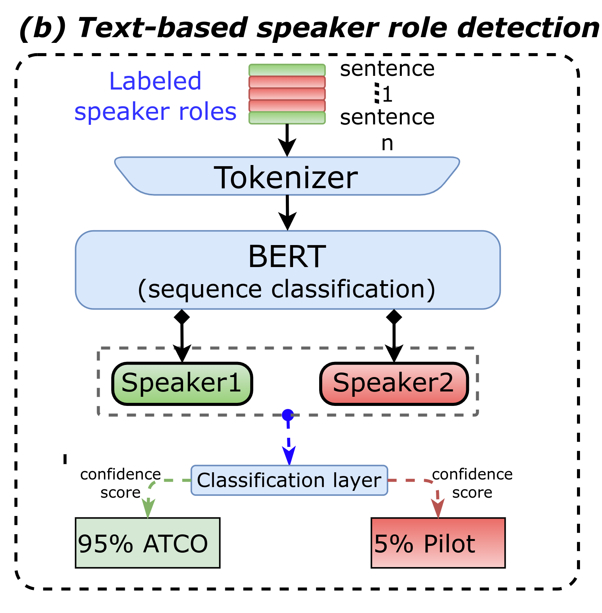

# Sequence Classification for ATC Communications

<p align="center">
    <a href="https://github.com/idiap/atco2-corpus/blob/master/LICENSE">
        
    </a>
    <a href="https://github.com/idiap/atco2-corpus">
        
    </a>
    <a href="https://github.com/psf/black">
        
    </a>
</p>

<p align="center">
    <a href="https://huggingface.co/Jzuluaga/bert-base-speaker-role-atc-en-uwb-atcc">
        
    </a>
    <a href="https://huggingface.co/datasets/Jzuluaga/atco2_corpus_1h">
        
    </a>
    <a href="https://huggingface.co/datasets/Jzuluaga/uwb_atcc">
        
    </a>
</p>


This folder contains the main files to train a sequence classification model using the ATCO2 corpus.

<p align="center">
 <figure>
  
  <figcaption> Overall pipeline to perform speaker role detection based on text. </figcaption>
</figure> 
</p>

---
For instance, if you have the following transcripts/gold annotations:

- *Utterance 1*: **lufthansa six two nine charlie tango report when established**
- *Utterance 2*: **report when established lufthansa six two nine charlie tango**


Could you tell who they belong to? Is it an air traffic controller talking, or rather a pilot? 
We solve this issue by fine-tuning a BERT module on the sequence classification task. Continue below if you are interested in how to do this...

# Datasets 

First, we need to donwload and prepare some databases. There are some public databases that are available for free, and some others that are not. We will only focus on the ones that are free! That way you can train/test a baseline model on your ATC data :)

We have already covered the data preparation in the data folder. Check the [README.md](../data/README.md) file in this folder for more information on each database. 

We will need:

ATCO2-test-set-1h corpus (for free):

- **Download a free sample of the ATCO2-test-set-1h** (only contains 1 hour of data): https://www.atco2.org/data
- **Corpus in HuggingFace format**: https://huggingface.co/datasets/Jzuluaga/atco2_corpus_1h | <a href="https://huggingface.co/datasets/Jzuluaga/atco2_corpus_1h"> </a>


UWB-ATCC corpus (for free): 

- **Download the UWB-ATCC corpus from**: https://lindat.mff.cuni.cz/repository/xmlui/handle/11858/00-097C-0000-0001-CCA1-0 
- **Corpus in HuggingFace format**: https://huggingface.co/datasets/Jzuluaga/uwb_atcc | <a href="https://huggingface.co/datasets/Jzuluaga/uwb_atcc"> </a>


# Folder strcuture

The `speaker_role` folder contains the following files:


```python
speaker_role/
├── data_preparation            # folder with data preparation scripts for different databases. You need to first run  this
│   ├── prepare_spkid_atco2_corpus_test_set_1h.sh
│   ├── prepare_spkid_atco2_corpus_test_set_4h.sh
│   ├── prepare_spkid_ldc_atcc_set.sh
│   └── prepare_spkid_uwb_atcc_set.sh
├── eval_model.sh               # bash script to run the evaluation of a sequence classification model
├── eval_sec_classification.py  # python script that run the evaluation of a sequence classification model given some dataset
├── README.md
├── sec_classification_utils.py # python script with utilities for running the models
├── train_baselines.sh          # bash script to train some baselines of speaker classification
├── train_one_model.sh          # bash script that calls the python script to train a baseline sequence classification model
└── train_sec_classification.py # main python script to train a baseline sequence classification model
```

# Usage

There are several steps to replicate/use our proposed models:

## Fine-tune a model from scratch

Here, we describe how to train one model with the **UWB-ATCC**, which is **free!!!**

You can train a baseline model with **UWB-ATCC** by calling the high-level script:

```bash
bash speaker_role/train_one_model.sh
```

That will fine-tune BERT-base [BERT-base-uncased model](https://huggingface.co/bert-base-uncased) model for 3k steps, with `batch_size` of 32 and gradient accumularion of 2.

Also, you can modify some training hyper-parameters by calling [train_one_model.sh](train_one_model.sh) (which call internally `train_sec_classification.py`) directly and passsing values from the CLI, e.g., `--per-device-train-batch-size 32` (instead of default=16)...

Another use case is to modify the train or evaluation data: 

- `--dataset-name "experiments/data/other/uwb_atcc/train/spkid_exp/utt2spk_id" `
- `--eval-dataset-name "experiments/data/other/atco2_test_set_1h/spkid_exp/utt2spk_id"`

---
## Out-of-the box model on HuggingFace

- You can use directly our model out-of-box by following the details here: https://huggingface.co/Jzuluaga/bert-base-speaker-role-atc-en-uwb-atcc#writing-your-own-inference-script
- The model is trained on [UWB-ATCC corpus](https://lindat.mff.cuni.cz/repository/xmlui/handle/11858/00-097C-0000-0001-CCA1-0). The UWB-ATCC dataset is already prepared in Datasets format here: https://huggingface.co/datasets/Jzuluaga/uwb_atcc

**You can download the data prepared, filtered and ready to go** by doing:

```python
from datasets import load_dataset

DATASET_ID = "Jzuluaga/uwb_atcc"
# or for atco2-test-set-1h
DATASET_ID = "Jzuluaga/atco2_corpus_1h"


# Load the dataset
uwb_atcc_corpus_train = load_dataset(DATASET_ID, "train", split="train")
uwb_atcc_corpus_test = load_dataset(DATASET_ID, "test", split="test")
```

## How to use the model?


```python
from transformers import pipeline, AutoTokenizer, AutoModelForSequenceClassification

tokenizer = AutoTokenizer.from_pretrained("Jzuluaga/bert-base-speaker-role-atc-en-uwb-atcc")
model = AutoModelForSequenceClassification.from_pretrained("Jzuluaga/bert-base-speaker-role-atc-en-uwb-atcc")


##### Process text sample (from UWB-ATCC)
from transformers import pipeline

nlp = pipeline('text-classification', model=model, tokenizer=tokenizer)
nlp("lining up runway three one csa five bravo")

[{'label': 'pilot',
'score': 0.9998971223831177}]
```


---
# How to cite us

If you use this code for your research, please cite our papers with the following bibtex items:

```
# article 1 - MAIN
@article{zuluaga2022atco2,
  title={ATCO2 corpus: A Large-Scale Dataset for Research on Automatic Speech Recognition and Natural Language Understanding of Air Traffic Control Communications},
  author={Zuluaga-Gomez, Juan and Vesel{\'y}, Karel and Sz{\"o}ke, Igor and Motlicek, Petr and others},
  journal={arXiv preprint arXiv:2211.04054},
  year={2022}
}

# article 2 - Mainly on ASR
@inproceedings{zuluaga2023does,
  title={How does pre-trained Wav2Vec 2.0 perform on domain-shifted ASR? An extensive benchmark on air traffic control communications},
  author={Zuluaga-Gomez, Juan and Prasad, Amrutha and Nigmatulina, Iuliia and Sarfjoo, Seyyed Saeed and Motlicek, Petr and Kleinert, Matthias and Helmke, Hartmut and Ohneiser, Oliver and Zhan, Qingran},
  booktitle={2022 IEEE Spoken Language Technology Workshop (SLT)},
  pages={205--212},
  year={2023},
  organization={IEEE}
}

# article 3 - Mainly on sequence classification and BERT  
@inproceedings{zuluaga2023bertraffic,
  title={Bertraffic: Bert-based joint speaker role and speaker change detection for air traffic control communications},
  author={Zuluaga-Gomez, Juan and Sarfjoo, Seyyed Saeed and Prasad, Amrutha and Nigmatulina, Iuliia and Motlicek, Petr and Ondrej, Karel and Ohneiser, Oliver and Helmke, Hartmut},
  booktitle={2022 IEEE Spoken Language Technology Workshop (SLT)},
  pages={633--640},
  year={2023},
  organization={IEEE}
}
```

